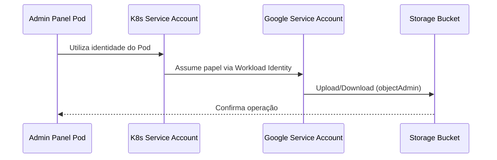

# GKE Scalable Infrastructure & Security Challenge (GCP Edition)

Este repositório contém a implementação de uma infraestrutura escalável, segura e automatizada no Google Cloud Platform (GCP). O projeto simula o provisionamento de um painel administrativo rodando em Kubernetes com acesso seguro a assets estáticos.

> **Nota Estratégica:** Embora o desafio original sugerisse AWS, optou-se pela **GCP** para viabilizar a validação completa de recursos avançados dentro do Free Tier.

---

## 📊 Resumo Técnico

- Infraestrutura provisionada com Terraform
- GKE privado com Workload Identity
- VPC segmentada com Cloud NAT
- Storage seguro com versionamento e logging
- 39 checks aprovados no Checkov
- 5 findings documentados (trade-offs)

---

## 🏗️ Arquitetura do Projeto

A infraestrutura foi desenhada seguindo o princípio de **Defesa em Profundidade**, com isolamento de rede e identidade.

---

### 🔐 Fluxo de Identidade (Workload Identity)



---

### 🌐 Arquitetura de Rede


---

## 🔐 Hardening e Segurança

### 🧱 Kubernetes (GKE)

- Private Cluster (nodes sem IP público)
- Workload Identity (sem uso de chaves)
- Shielded Nodes (Secure Boot + Integrity Monitoring)
- Network Policies habilitadas
- Client Certificate desabilitado

---

### 🌐 Networking

- VPC customizada (sem subnet automática)
- VPC Flow Logs habilitado (auditoria de tráfego)
- Private Google Access habilitado
- Cloud NAT para saída segura à internet
- Firewall explícito para tráfego interno

---

### 🗄️ Storage

- Public Access Prevention habilitado
- Uniform Bucket-Level Access
- Versionamento ativo
- Logging de acesso habilitado

---

## 📊 Relatório de Auditoria (Checkov)

| Status | Quantidade | Descrição |
|--------|-----------|----------|
| ✅ Passed | 39 | Cumpre boas práticas de segurança |
| ❌ Failed | 5 | Trade-offs documentados |

---

## ⚠️ Trade-offs de Segurança

Alguns controles não foram aplicados intencionalmente neste laboratório:

- **Binary Authorization**  
  Requer pipeline de CI/CD com assinatura de imagens.

- **Master Authorized Networks**  
  Não aplicado para evitar bloqueio de acesso durante avaliação.

- **RBAC com Google Groups**  
  Depende de integração com Google Workspace/Cloud Identity.

- **Metadata Server (Cluster)**  
  Já configurado no node pool — considerado falso positivo do Checkov.

- **Logging em bucket separado**  
  Para simplificação, os logs são gravados no próprio bucket.  
  Em produção, recomenda-se bucket dedicado.

---

## 🚀 Como Executar

### Pré-requisitos

- Terraform >= 1.0
- Google Cloud SDK (`gcloud`)
- Projeto GCP com faturamento habilitado

---

### 1. Provisionar Infraestrutura

```bash
terraform init
terraform plan
terraform apply -auto-approve
```

---

### 2. Configurar acesso ao cluster

```bash
gcloud container clusters get-credentials admin-cluster \
  --region southamerica-east1
```

---

### 3. Deploy da aplicação

```bash
cd k8s/
kubectl apply -f admin-panel-deployment.yaml
```

---

### 4. Validar execução

```bash
kubectl logs -l app=admin-panel
```

Saída esperada:

```
✅ SUCESSO: Arquivo enviado para o bucket!
```

---

## 🔮 Melhorias Futuras

- Integração com Secret Manager
- Autoscaling com VPA
- Service Mesh (Istio / Anthos)
- Binary Authorization completo
- Bucket de logs dedicado

---

## 🏁 Conclusão

A solução entrega um ambiente seguro, funcional e alinhado com boas práticas de infraestrutura em nuvem, mantendo equilíbrio entre segurança, custo e complexidade.

Os trade-offs foram documentados e refletem decisões conscientes para um ambiente de laboratório.